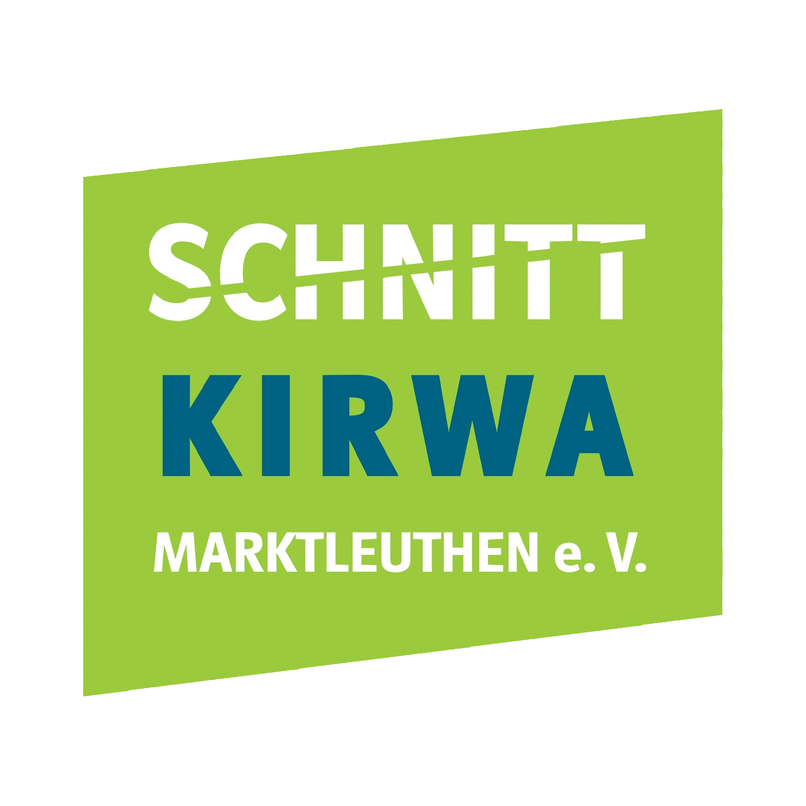

# Homepage: [Schnittkirwa Marktleuthen e.V.](https://schnittkirwa.de)

  

## Inhalt

Die Schnittkirwa gilt als größtes Fest im Veranstaltungskalender der Stadt Marktleuthen und bietet ein vielfältiges Programm für alle Altersgruppen über drei Tage hinweg.

Diese Website dient als zentrale Informationsplattform für:
- Vereinsinformationen und Zweck
- Vorstellung des Vorstands
- Ablauf und Programm der Veranstaltungen
- Bilder und Dokumente
- Kontaktmöglichkeiten und Mitgliedsanträge